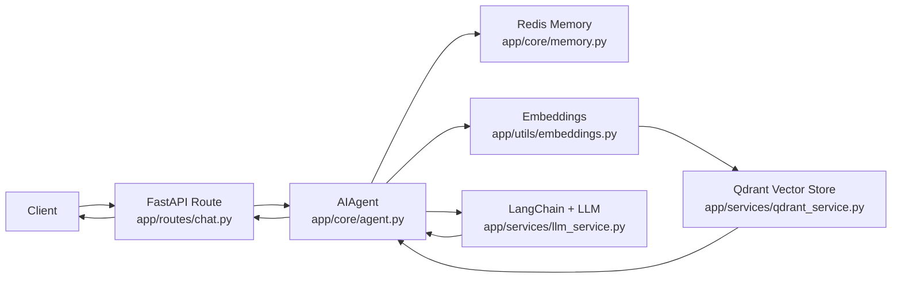

# AI Agent Framework with RAG and Persistent Memory

This repository is a compact prototype for a chat-based AI assistant built with FastAPI, LangChain, Qdrant, and Redis. It demonstrates how to combine retrieval-augmented generation (RAG) with session-based memory so the assistant can answer domain-grounded questions across multiple turns.

The project is intentionally scoped as a portfolio-style backend prototype rather than a production-ready platform. The goal is to make the data flow easy to understand, and run locally.

## Stack

- FastAPI for the HTTP API layer
- LangChain for prompt orchestration and conversational flow
- OpenAI-compatible chat and embedding models
- Qdrant for vector storage and semantic retrieval
- Redis for session-backed conversation memory
- Pytest with mocks for lightweight unit coverage

## Features

- `POST /chat/` endpoint for multi-turn chat
- Retrieval pipeline that embeds the user query and searches Qdrant
- Prompt assembly that injects prior conversation history and retrieved context
- Redis-backed session memory keyed by `session_id`
- Knowledge-base seeding script for chunking documents and storing embeddings
- Docker Compose setup for local Redis and Qdrant services

## Repository Layout

```text
app/
  main.py                    FastAPI entry point
  config.py                  Environment-based settings
  routes/chat.py             Chat API endpoints
  core/agent.py              Main orchestration logic
  core/memory.py             Redis-backed session memory
  services/llm_service.py    LLM setup
  services/qdrant_service.py Vector store operations
  utils/embeddings.py        Embedding helpers
  utils/ranking.py           Result ranking and filtering
data/
  knowledge_base/            Add .txt or .md files here before seeding
scripts/
  seed_knowledge.py          Chunk, embed, and load documents into Qdrant
tests/
  test_agent.py
  test_api.py
  test_memory.py
  test_rag.py
docs/
  ARCHITECTURE.md            High-level architecture and request flow
docker-compose.yml           Redis and Qdrant services
```

## How It Works

1. A client sends a message to `POST /chat/` with an optional `session_id`.
2. The API creates an `AIAgent` instance.
3. The agent loads prior conversation history from Redis.
4. The message is converted into an embedding vector.
5. The vector is used to retrieve relevant chunks from Qdrant.
6. Retrieved context and conversation history are injected into the prompt.
7. LangChain calls the chat model and returns a response.
8. The interaction is persisted under the same session in Redis.

More detail is available in [docs/ARCHITECTURE.md](./docs/ARCHITECTURE.md).

## Simple Architecture



## Quick Start

### 1. Configure environment variables

Copy the example file and set your API key:

```bash
copy .env.example .env
```

This project accepts either `OPENAI_API_KEY` or `LLM_API_KEY`.

### 2. Start infrastructure

Start Redis and Qdrant:

```bash
docker-compose up -d redis qdrant
```

### 3. Install dependencies

```bash
pip install -r requirements.txt
```

### 4. Add knowledge-base documents

Place a few `.txt` or `.md` files under `data/knowledge_base/`.

### 5. Seed the vector store

```bash
python scripts/seed_knowledge.py --dir data/knowledge_base
```

### 6. Run the API

```bash
uvicorn app.main:app --reload
```

The API will be available at `http://localhost:8000`.

## Example Request

```json
POST /chat/
{
  "message": "Summarize the retention metrics definition",
  "session_id": "demo-session"
}
```

Use the same `session_id` across requests to preserve conversation context in Redis.

## Example Demo Output

After seeding the sample knowledge-base document in `data/knowledge_base/test.txt`, a prompt like:

```json
curl -X POST http://127.0.0.1:8000/chat/ -H "Content-Type: application/json" -d '{"message":"What technologies does Alyssa project use?","session_id":"session_1"}'
```

should return a grounded answer that mentions `FastAPI`, `Qdrant`, and `Redis`, plus a non-empty `sources` list pointing back to `test.txt`.

```json
curl -X DELETE http://127.0.0.1:8000/chat/delete/session_1
```


## Testing

Run unit tests with:

```bash
python -m pytest
```

Tests use mocks for Redis, Qdrant, and model calls, so they are mainly intended to validate control flow rather than full end-to-end behavior.

## Demo Tips

- Use a fresh `session_id` when testing retrieval changes so older chat history does not affect the result.
- Re-run `python scripts/seed_knowledge.py --dir data/knowledge_base` after changing knowledge-base documents.
- Restart `uvicorn` after editing application code.
